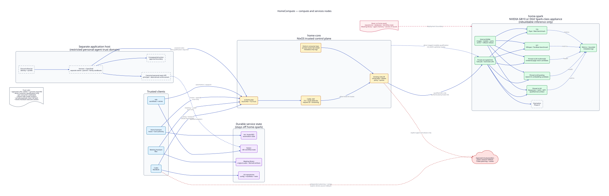

# HomeCompute

> **Current priority (2026-09-04):** prepare and install GMKtec, then migrate
> inventoried HAOS supporting services one at a time. GB10 is not available.
> Follow the [GMKtec-first rollout](docs/ai-services-01-rollout-plan.md#start-now-without-gb10);
> non-AI migrations require host, backup/restore, networking, and application
> gates, but do not require GB10 or a new AI gateway. Home Assistant stays on
> HAOS and Hermes remains deferred.

HomeCompute is a local-first AI platform for private inference, automation,
voice, meetings, coding, research, and personal agents.

The platform has two physical node roles:

- `ai-services-01` is an always-on x86 NixOS control-plane host. It
  owns the trusted gateway, its dedicated database, backups, and other approved
  durable state; untrusted workloads remain elsewhere.
- `ai-compute-01` is an NVIDIA GB10 or DGX Spark-class appliance. It runs
  rebuildable text, speech, and diarization inference services.

Clients use `https://ai.home.arpa`. They do not call the compute node or concrete
model names directly.

> **Status:** this repository is a guarded deployment scaffold, not a turnkey
> installer. Physical installation and production qualification have not been
> completed.



## What the platform is for

| Use case | Public route or alias | Intended capability |
| --- | --- | --- |
| Coding | `coding` | Codex-compatible editing, tools, builds, tests, and repository work |
| Automation | `automation` | n8n workflows, structured output, and approved MCP tools |
| Private research | `research` | Source-bounded synthesis over approved private or public material |
| Home Assistant | `home` | Danish/English conversation and safe tool proposals; Home Assistant executes actions |
| Meetings | `meeting` | Transcription, diarization, summaries, decisions, and action extraction |
| Personal agents | `assistant` | Isolated assistant sessions with explicit tool and data permissions |
| Speech to text | fixed STT route | Danish, English, and mixed-language transcription |
| Text to speech | fixed TTS route | A qualified Danish voice for short and long responses |

Logical aliases are stable contracts. A model may back several aliases only
after it passes each use case's quality, safety, latency, and recovery tests.

## Model candidates

No production model has been selected. The repository starts with one efficient
shared text candidate, then compares specialists and controls one at a time.

| Candidate | What it is evaluated for |
| --- | --- |
| NVIDIA Qwen3.6 35B A3B NVFP4 | First text integration baseline across all six aliases; especially automation, research, home, meetings, and assistant tools |
| Qwen3-Coder-Next FP8 | Primary specialized coding candidate |
| NVIDIA Nemotron 3.5 Lightning NVFP4 | Efficient coding and agent-performance challenger |
| Gemma 4 31B NVFP4 and Qwen3.8 27B FP8 | Dense general, automation, and coding quality challengers |
| Devstral Small 2 | Lower-memory and latency control |
| gpt-oss-120b | Serialized high-capacity coding and automation comparison |
| Danish Parakeet and Whisper large-v3 variants | Speech-to-text candidates for home and meeting audio |
| Piper Danish and Røst | Danish text-to-speech reliability and naturalness candidates |
| Qwen3 Embedding and Reranker | Deferred private retrieval candidates, added only with a real corpus |

The first deployed text model is a smoke-test candidate, not a production
winner. See the [model recommendation](docs/research/llm-installation-recommendation.md)
for exact artifact names, order, and qualification caveats.

## Setup in order

The complete operator path is in the [setup guide](docs/setup-guide.md). You
can follow it without reading the detailed plans.

Interactive use is private: approved local networks or Tailscale reach only
the authenticated gateway at `https://ai.home.arpa`. Apply the
[local/Tailscale access policy](docs/access-policy.md) before enabling remote
clients.

1. Record hostnames, IP addresses, DNS, the private compute subnet, backup
   target, and rollback owners.
2. Install the pinned NixOS 26.05 flake on `ai-services-01`, then configure its
   observed LAN and private-compute interfaces declaratively.
3. Deploy and verify the digest-pinned Caddy/LiteLLM/PostgreSQL stack on
   loopback, then configure and restore-test off-host backup.
4. Prepare the supported DGX OS baseline on `ai-compute-01` and configure its
   management and private-compute addresses.
5. Initialize, validate, and install the first pinned text-inference tuple with
   `setup-compute-node.sh`.
6. Connect the private link and allow only `ai-services-01` to reach inference
   ports.
7. Point the already-loopback-tested gateway at the qualified compute endpoint,
   apply its exact ingress/egress policy, then expose `https://ai.home.arpa` to
   approved clients.
8. Benchmark model candidates and migrate automations or consumers one at a
   time, retaining rollback until each acceptance gate passes.

The node baselines may be built in parallel. Gateway integration needs both
nodes, and no durable service should move before an off-host restore test.

## What the repository provides

- a guarded setup script for the vendor-managed compute node;
- a pinned NixOS host configuration with integrated Home Manager and sops-nix;
- a hardened control-plane Compose stack with state below `/srv/state`;
- a hardened Compose definition for the first compute-node text candidate;
- configuration templates that reject unresolved placeholders;
- architecture, detailed plans, verification criteria, risks, and research;
- editable D2 diagrams with rendered SVG and PNG versions.

It does not include an OS installer, credentials, model weights, container
images, production data, or completed benchmark evidence. It also does not yet
provide a turnkey gateway or application-service deployment.

## Prerequisites

For `ai-services-01`:

- an x86 host with enough CPU, memory, storage, and two network ports;
- a public SSH key, reserved LAN/private-compute
  values, a persistent age identity, and an off-host backup target;
- reviewed immutable image digests and the matching compute API credential.

For `ai-compute-01`:

- an NVIDIA GB10 or DGX Spark-class appliance with supported DGX OS;
- working NVIDIA drivers, Docker, Compose, and NVIDIA Container Toolkit;
- Bash, `curl`, `jq`, `openssl`, and standard Linux administration tools;
- pinned image/model revisions, provenance records, and external secret files.

## Safety boundaries

- Keep durable data off the rebuildable compute node.
- Keep inference on loopback until the private gateway path is ready.
- Never expose compute runtime ports, Docker, databases, or host management to
  the internet.
- Use separate, revocable client credentials at the gateway.
- Keep logs metadata-only; exclude prompts, outputs, audio, and credentials.
- Keep private workloads local unless a route explicitly allows cloud fallback.
- Let Home Assistant validate and execute home actions; the model only proposes
  calls to an allow-listed tool surface.

See the [risk analysis](docs/risk-analysis.md) before exposing a service or
migrating production state.

## Documentation

| Need | Document |
| --- | --- |
| Follow the full installation | [Setup guide](docs/setup-guide.md) |
| Understand the architecture | [Architecture](docs/architecture.md) |
| See the complete build order | [Platform execution plan](docs/platform-execution-plan.md) |
| Install the control-plane host | [NixOS control-plane plan](docs/nixos-control-plane-node-plan.md) |
| Apply, roll back, update, or extend NixOS | [NixOS operations guide](docs/nixos-operations.md) |
| Inspect compute-node details | [Compute-node plan](docs/ai-compute-node-plan.md) |
| Pilot Hermes on `ai-services-01` | [ADR-017](docs/adr/017-consolidated-application-host.md), then [NemoClaw placement and Hermes setup](docs/research/nemoclaw-machine-placement.md) |
| Run acceptance tests | [Verification strategy](docs/verification-strategy.md) |
| Understand model choices | [Model recommendation](docs/research/llm-installation-recommendation.md) |

## Repository layout

| Directory | Contents |
| --- | --- |
| [`automations/`](automations/README.md) | Importable monitoring and operations workflow templates |
| [`config/`](config/README.md) | Operator configuration templates |
| [`hosts/`](hosts/ai-services-01/default.nix) | Per-host NixOS entry points and hardware contracts |
| [`modules/nixos/`](modules/nixos/system.nix) | System configuration, networking, firewall, Docker, SSH, Tailscale, storage, backups, and secrets |
| [`home/`](home/mads/default.nix) | Home Manager user environments |
| [`deploy/`](deploy/README.md) | Docker Compose application workloads |
| [`diagrams/`](diagrams/README.md) | D2 sources and rendered diagrams |
| [`docs/`](docs/README.md) | Plans, requirements, verification, and research |
| [`scripts/`](scripts/README.md) | Guarded setup and operations commands |

## Development validation

```bash
./scripts/validate-repository.sh
```

See the [NixOS operations guide](docs/nixos-operations.md) for the staged
commit check, build/test/switch workflow, rollback, input updates, and extension
rules.

Target-host preflight, smoke, benchmark, recovery, and acceptance tests still
require the actual systems and operator-supplied configuration.

## Contributing and license

See [CONTRIBUTING.md](CONTRIBUTING.md) and report security issues using
[SECURITY.md](SECURITY.md).

HomeCompute uses the [Apache License 2.0](LICENSE). Models, images, and other
third-party software keep their own licenses and are not redistributed here.
