# HomeCompute architecture

**Version:** 0.2  
**Date:** 2026-08-25  
**Status:** Proposed for Phase C hardware validation

## Decision summary

The GB10 is a replaceable inference appliance behind the existing AI Home
control plane. Hermes/OpenShell runs as a separate personal-agent application
layer on an always-on application host and consumes GB10 inference through the
qualified edge. A direct-on-GB10 NemoHermes deployment is useful as an ARM64
pilot, but it is not promoted without an ADR because its persistent sandbox
state would change the appliance's failure and backup boundaries. The initial
runtime PoC uses a pinned NVIDIA NGC vLLM image and one qualified text model.
The production candidate reuses LiteLLM on the existing always-on host behind a
Caddy TLS edge at `https://ai.home`; TensorRT-LLM is the controlled performance
challenger. Direct Codex-to-vLLM remains the protocol and latency baseline.

The stable node roles are `ai-compute-01` for the GB10 appliance and
`ai-services-01` for the future x86/Proxmox layer. Its `ai-gateway-01`,
`automation-01`, and `toolbox-01` VMs preserve the logical boundaries below.
This is a migration target, not a claim that existing services have moved.

The first text model may back `coding`, `automation`, `research`, `meeting`,
`home`, and `assistant` if it passes each role's tests. These aliases describe work, not
placement. `home`, `meeting`, and private automation are local-only; `research`
may use an explicit cloud fallback. STT, TTS, and later diarization remain
separate fixed-path inference services.

Stage 2 preserves Codex as the developer UX. Installed Codex 0.145.0 exposes a
role-layer provider override and is the pinned cross-provider PoC candidate;
0.149.1 omits that override, and nearby releases have reported task-delivery
failures. The target flow is gated on an end-to-end 0.145.0 canary and a safe
client pin. Until it passes, cloud and GB10 are explicit whole-session modes.

## Architectural principles

1. Consumers depend on logical capabilities, never model artifacts or runtime ports.
2. The edge is the only client-LAN entry point; inference and management listeners are private.
3. Home Assistant owns tools and device authorization; models only propose calls.
4. Existing n8n workflows and Notion state remain on their verified current hosts.
5. Aula remains inside the existing n8n/Aula-MCP workflow and has no separate platform identity.
6. Meeting Assistant remains the meeting-domain owner; GB10 supplies inference only.
7. The existing LiteLLM control plane is extended rather than duplicated.
8. Telemetry is metadata-only by default.
9. Every deployed artifact is pinned, qualified as a tuple, and reversible.
10. A feature not proven by the current released client/runtime is a gate, not a promise.
11. Hermes is an agent runtime, not an authorization layer or canonical personal database.
12. Profile identity and `owner_scope` are enforced before/below the model; prompt instructions never grant access.
13. Existing deterministic home control remains independent of GB10 and the assistant.

## 1. System context

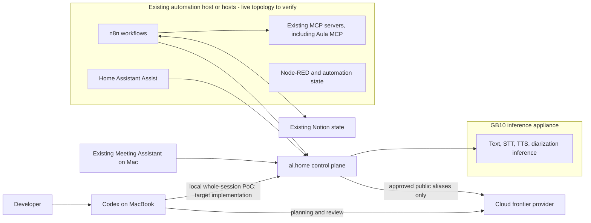

## 2. Deployment

```mermaid
flowchart TB
    subgraph Mac[MacBook Pro]
        C[Codex CLI / desktop]
        MA[Meeting Assistant + meeting library]
        R[Git repositories, IDE, builds, tests]
        C <--> R
    end

    subgraph HomeServer[Existing home-automation host(s), topology to verify]
        H[Home Assistant]
        N[n8n]
        M[MCP servers]
        HN[Existing automation/state]
        N --> M
    end

    subgraph ControlPlane[Existing AI Home host]
        E[Caddy TLS edge]
        L[Existing LiteLLM, upgraded and qualified]
        CP[Credential/policy metadata]
        E --> L
        L --> CP
    end

    subgraph GB10[GB10: containerized inference only]
        T[vLLM text runtime]
        S[STT service]
        V[TTS service]
        D[Diarization service, Phase H]
        O[Metrics/log agents]
        T -. metrics .-> O
        S -. metrics .-> O
        V -. metrics .-> O
        D -. metrics .-> O
    end

    C -->|TLS + Codex credential| E
    MA -->|TLS + meeting credential| E
    H -->|TLS + HA credential| E
    N -->|TLS + n8n credential| E
    L --> T
    E --> S
    E --> V
    E --> D
    L -->|approved public aliases| Cloud[Cloud models]
```

No repository, build tool, n8n instance, Home Assistant instance, MCP server,
Notion replica, meeting library, generic queue/database, vector database,
Hermes/OpenShell runtime, or agent memory is deployed to GB10 in production.

### 2.1 Planned role-based node realization

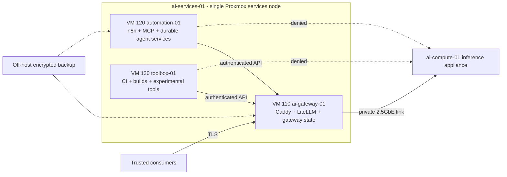

The Proxmox host runs no application containers. Only `ai-gateway-01` attaches to
the private GB10 bridge. Home Assistant remains on its current host unless a
later, separately restored and tested HAOS VM migration is approved. See the
[AI services node plan](ai-services-node-plan.md).

## 3. Shared API and GB10 services

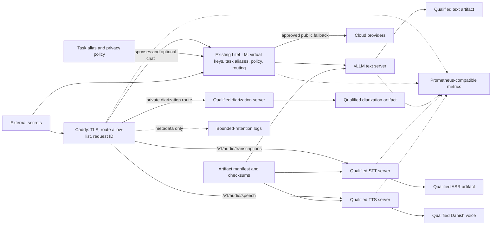

The LiteLLM instance is the one already defined by AI Home. It is not copied to
GB10. It becomes production-capable only after virtual-key isolation,
Responses/tool streaming, privacy, retry, and local/cloud policy tests pass.

## 4. Network boundaries

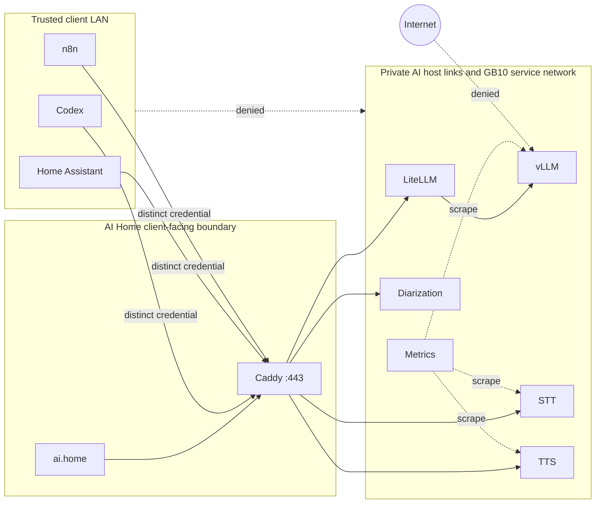

Management access is a separately authenticated administrative path and is not
part of the inference API. Exact firewall technology is a host-design decision;
the required result is testable reachability, not a particular vendor. Because
the control plane and GB10 are separate hosts, their link must use Tailscale or
an equivalently restricted encrypted LAN/VPN path with firewall allow-listing;
it is not assumed to be one cross-host Docker network.

## 5. Existing n8n request flow

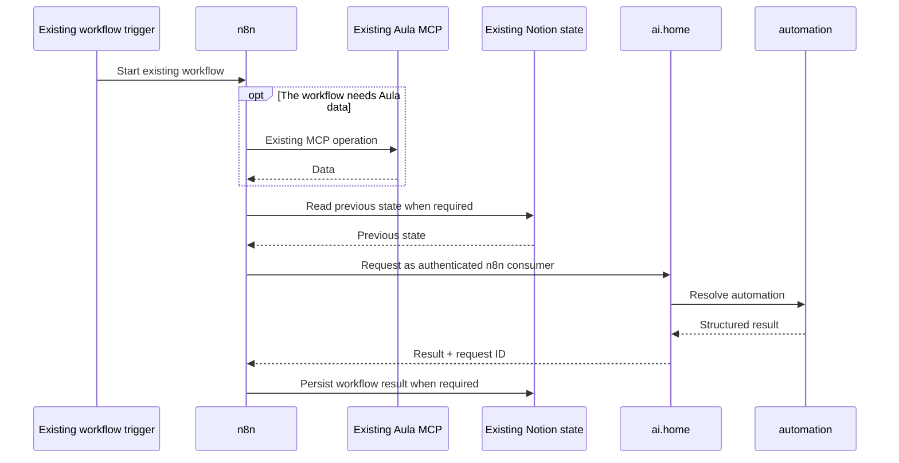

There is no Aula-to-GB10 route and no Aula-specific model. Sensitive Aula data
is one possible request payload in the existing n8n flow; no layer logs it.

## 6. Home Assistant voice and tool flow

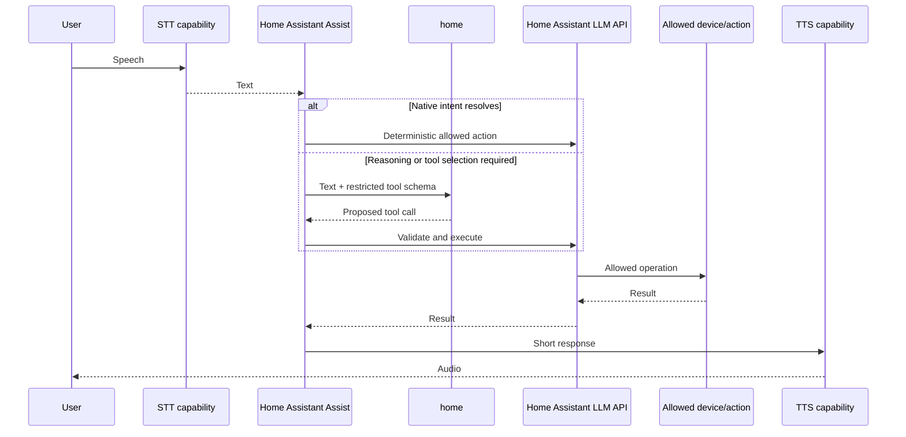

The LLM never gets direct Zigbee, MQTT, Node-RED, device, or administrative
access. Dangerous operations require separate explicit test and authorization
policy.

## 7. Meeting Assistant and Plaud flow

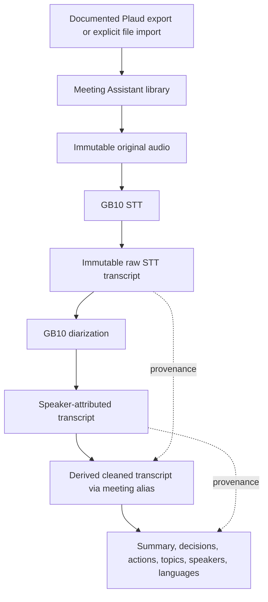

Meeting Assistant owns import state, artifacts, retries, and user-visible
records. GB10 services are replaceable inference workers. An imported audio
file is retained before inference begins; failure leaves the job retryable and
never triggers cloud upload. The first ingestion path is an explicit file
import or watched folder backed by a documented Plaud export. A private Plaud
API or scraper is not assumed.

## 8. Codex plan / implement / review

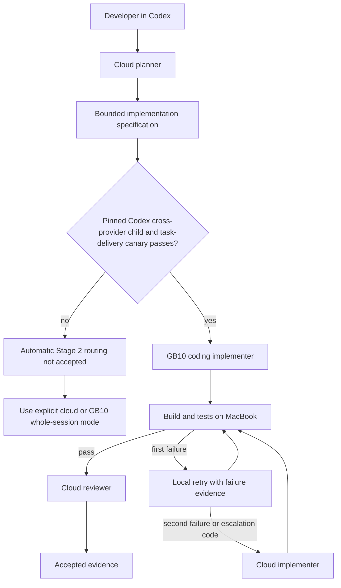

The diagram separates the intended architecture from unqualified client
behavior. A production agent file is activated only on the exact client version
that passed provider selection and task/follow-up delivery.

## 9. Local / cloud fallback

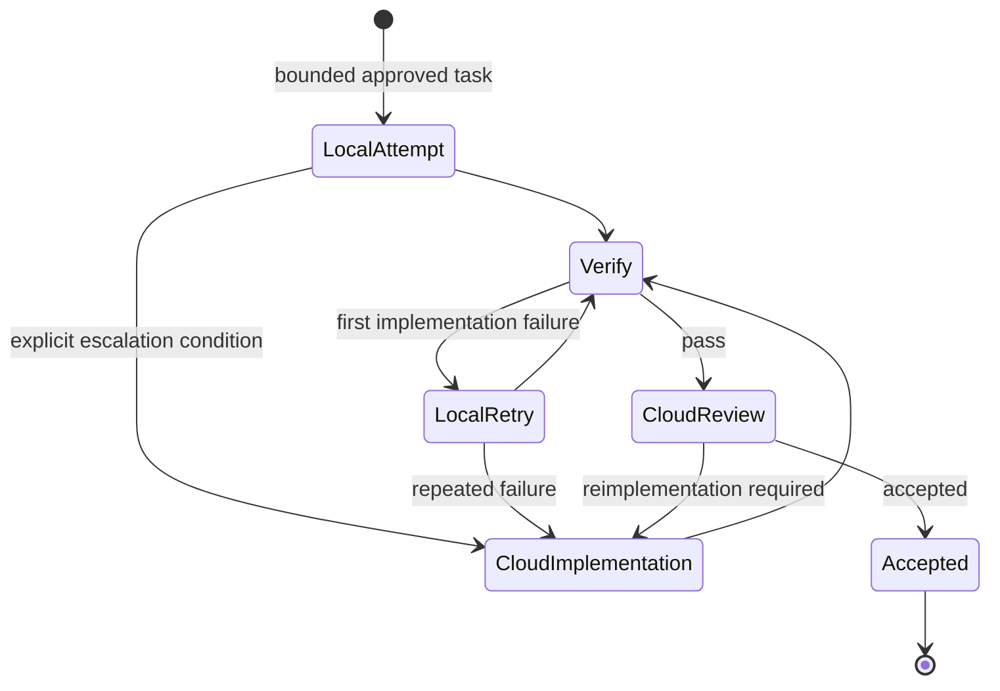

Fallback is orchestration-level and recorded. The gateway does not silently
replace `coding` mid-request. Home Assistant and Meeting Assistant private
routes have no hidden model fallback; they fail closed or remain pending.

## 10. Storage layout

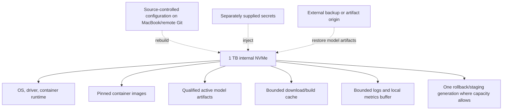

The GB10 is rebuildable, not the sole source of configuration or durable
workflow data. External storage is introduced only when measured capacity,
backup time, or artifact retention requires it.

## 11. Model-routing architecture

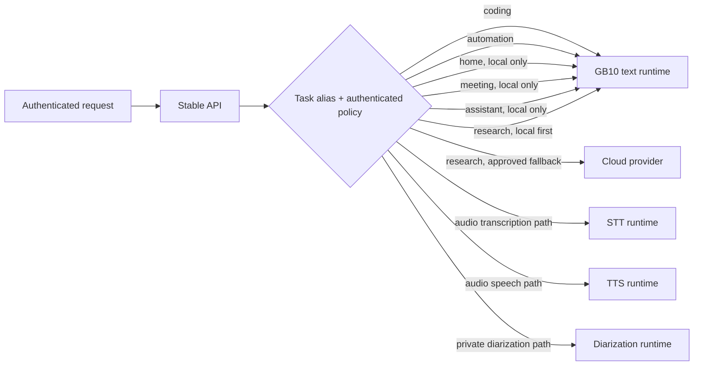

Initially one model may implement several aliases. That is not equivalent to
loading multiple models. LiteLLM owns the mapping and enforces an allow-list per
virtual key. Payload sensitivity is not inferred by another LLM: callers use a
policy-qualified alias/credential, and private aliases have no cloud fallback.

## 12. Failure boundaries

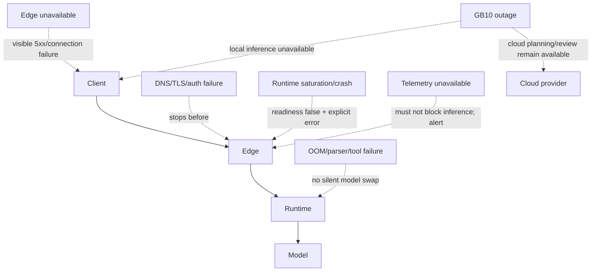

Health checks do not convert a failed model into a successful response. They
remove unready backends and preserve a diagnosable failure. Automatic coding
fallback is allowed only in the qualified Codex orchestration; Home Assistant
action fallback is not.

## 13. Personal assistant platform

Hermes fits as a consumer and agent loop, not as a replacement for LiteLLM,
n8n, Home Assistant, Meeting Assistant, or the personal data store:

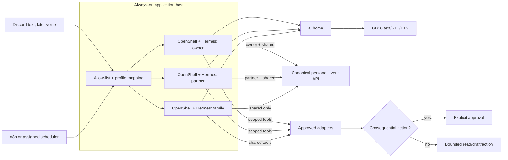

Each profile has a separate OpenShell sandbox, writable state root, channel
credential, model virtual key, data-store role, and tool credential set. The
Discord adapter resolves an allow-listed user/channel to a profile before
dispatch; the model cannot choose or widen that profile.

Hermes memory stores preferences, goals, and learned working context. A
separate service owns normalized personal events and enforces row/collection
authorization. Ingestion, schedules, retries, deduplication, and outbound
notification policy remain deterministic workflow concerns. NemoClaw supplies
the Hermes integration while OpenShell supplies the sandbox/runtime. The pilot
must inspect the effective live policy and deny undeclared filesystem,
credential, LAN, and host access before selection. Hermes requires a 64K
context per active session, so agent qualification repeats the memory and mixed
load tests at that context rather than relying on smaller runtime baselines.

## Component responsibilities

| Component | Owns | Explicitly does not own |
| --- | --- | --- |
| Caddy edge | Stable DNS/TLS endpoint, route allow-list, request identity, forwarding, edge metrics/log policy | Prompt persistence, model selection quality, workflow state |
| Existing LiteLLM | Virtual keys, task aliases, local/cloud route policy, quotas and model metadata | Durable conversation memory, default prompt logging, hidden private-route fallback |
| vLLM | Qualified model execution, Responses/tool streaming, scheduling, runtime metrics | Client identity policy, application state, MCP execution |
| STT/TTS/diarization services | Qualified audio inference | Home Assistant intent/action policy, meeting state |
| Home Assistant | Assist routing, exposed tools/entities, action execution | Model hosting |
| n8n | Existing workflows, retries, Notion state, Aula MCP usage | Model/runtime coupling |
| Meeting Assistant | Live/Plaud meeting lifecycle, artifacts, provenance, summaries and retries | Model hosting, silent cloud fallback |
| Codex | Developer UX, tool execution, target orchestration and fallback evidence | Runtime implementation |
| Hermes profile runtime | Conversation/tool loop, profile-local working memory and skills, bounded task execution | Identity proof, canonical history, broad LAN/host access, consequential-action authorization |
| Discord adapter | Allow-listed identity/channel mapping, session routing, rate limits and notifications | Inferring identity from message text or voice |
| Personal event service | Canonical event/provenance records, `owner_scope` enforcement, idempotent retrieval and retention | Agent personality or autonomous external actions |
| Assigned scheduler/n8n | Ingestion, retry, schedule, normalization, deduplication and delivery ownership | User authorization policy or unrestricted agent execution |

## Architecture gates

1. Direct Codex → vLLM completes the Responses/tool/compaction suite.
2. Caddy and the existing LiteLLM path pass the identical suite and the latency/privacy budget.
3. Home Assistant completes the restricted-tool PoC before model selection.
4. Runtime/model candidates pass same-workload benchmarks on the actual GB10.
5. The selected resident-model set passes memory and mixed-load tests including background meeting transcription.
6. Meeting Assistant passes gateway-account, local-only, artifact-provenance, Plaud import, and diarization gates before Plaud automation is enabled.
7. Stage 2 automatic routing waits for the pinned 0.145.0 cross-provider canary; every later client version must requalify before upgrade.
8. Hermes passes a single-profile application-host, 64K local-model, persistence, tool, upgrade, and rollback pilot; a separate direct DGX Spark/ARM64 demo may validate vendor support but does not change production placement.
9. Three-profile identity, credential, filesystem, network, and `owner_scope` negative tests pass before Family or private Discord access is enabled.
10. Discord text and low-risk proactive tasks pass before voice, email, or financial ingestion; financial data is last.

The supporting decisions are recorded under `docs/adr/`; operational details
are deliberately excluded from this logical architecture.
