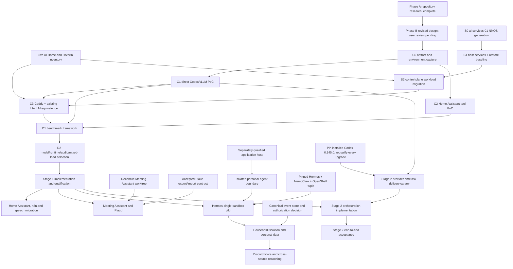
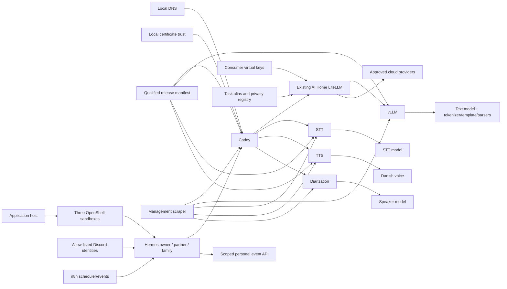
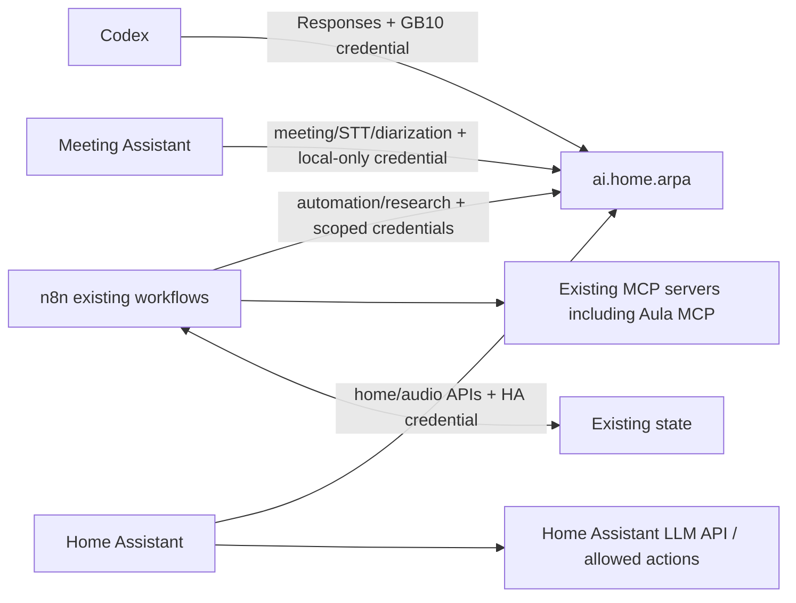

# Dependency graph

**Date:** 2026-08-25

## Phase and gate dependencies

The versioned Codex canary does not block C0–E or whole-session local Codex
qualification. It blocks only automatic cloud-parent to compute-node-child Stage 2.

## Component dependencies

## Consumer dependencies

Aula has no direct dependency on the edge or GB10. The dependency is the
existing n8n workflow, which may call the existing Aula MCP and then use
`automation` like any other private n8n request.

## Critical-path inputs

| Input | Needed by | Source/owner | Failure effect |
| --- | --- | --- | --- |
| Physical GB10 access | C0 onward | Project owner | Hardware PoC/benchmarks Not Run |
| Supported DGX OS/driver/CUDA tuple | C0 | NVIDIA platform | Runtime cannot be qualified |
| NGC access and immutable image digest | C0/C1 | NVIDIA registry | vLLM baseline cannot start reproducibly |
| Candidate model access/license/revision | C0/D2 | Model publisher/project | Alias cannot be selected |
| Local DNS and certificate trust choice | C3/E | LAN owner | Stable TLS endpoint cannot be accepted |
| Test credentials | C3/E | Security/LAN owner | Consumer identity/auth tests cannot run |
| Live AI Home inventory and rollback path | C3/E | Control-plane owner | Existing LiteLLM cannot be safely reused |
| Home Assistant test integration/entity set | C2/D2 | HA owner | Tool and voice role cannot be qualified |
| Meeting Assistant clean/reconciled baseline | H | Meeting owner | Plaud/gateway integration must not start |
| Supported Plaud export/import contract and storage location | H | Meeting owner | Plaud automation remains blocked |
| Representative repository fixtures | D1/D2/F2 | Developer | Coding KPI cannot be established |
| Pinned Codex 0.145.0 binary and role config | F0 | MacBook/project owner | Automatic Stage 2 remains blocked if provider/task delivery fails |
| Always-on application host with supported OpenShell prerequisites | I/J | Platform owner | Hermes remains a synthetic/direct-GB10 demo only |
| Pinned Hermes/NemoClaw/OpenShell/sandbox tuple | I/J | Agent-platform owner | Personal assistant cannot be qualified or restored |
| 64K context and concurrent-session memory evidence | I/J | Inference owner | Hermes workload cannot share the GB10 production model safely |
| Discord bot/application identities and private test channels | I/J | Household owner | Text/voice routing cannot be accepted |
| Canonical personal event-store host and authorization contract | J | Data/security owner | Private ingestion and cross-source reasoning remain blocked |

## Decision dependencies

| Decision | Required evidence |
| --- | --- |
| vLLM remains primary | C1 pass plus D2 runtime comparison |
| Caddy remains edge | C3 contract/auth/privacy/latency pass |
| Reuse existing LiteLLM | Live inventory plus full Caddy/LiteLLM proxy, virtual-key, privacy, recovery, and latency qualification |
| Shared text model | Every mapped role benchmark plus mixed-load/memory pass |
| Reserved `home` | Shared configuration misses P0 gate and reserved design fits memory |
| Add generic meeting queue/database | Existing Meeting Assistant recovery/load evidence proves a concrete gap |
| External storage | Measured artifact/rollback/rebuild requirement exceeds internal policy |
| Activate automatic Stage 2 | Pinned client passes provider, initial/follow-up task, tool, retry and review canary |
| Promote Hermes beyond one synthetic sandbox | 64K direct/proxied model pass, snapshot/restore, default-deny egress, managed credential and approval tests |
| Add Partner/Family profiles | Cross-sandbox Discord, session/memory, API/data scope, MCP credential and notification-destination denials |
| Add Discord voice | Text soak passes; Danish/English STT/TTS, pause/interruption, Opus/ARM64 and mixed-load evidence |
| Add bank data | Profile isolation, read-only ingestion, audit, retention, backup/restore and request-bound approval gates pass |
