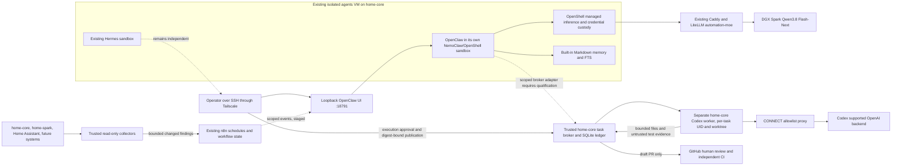

# OpenClaw and home-core Codex pilot

Status: the approved synthetic OpenClaw sandbox has been created in the existing
agents VM; qualification is recorded in [managed evidence](openclaw-nemoclaw.md).
The standalone Compose fallback and Codex worker remain **disabled and not deployed**.
Unattended Codex authentication, real GitHub publishing, reboot and restore
acceptance remain release gates. The model route is Qwen3.8 Flash-Next
behind `automation-moe`; no model cutover is part of this change. See
[discovery](openclaw-discovery.md) for dated live evidence and every n8n workflow.

## Architecture and choice

Target architecture: the synthetic managed assistant is live; broker, worker,
scheduled observation delivery and Home Assistant integration remain staged.



The observed K15 is `home-core`, so selecting a separate K15 is not an available
placement decision. The recommended household target is **a separate OpenClaw
NemoClaw/OpenShell sandbox in the existing agents VM on home-core**, alongside
Hermes. NemoClaw/OpenShell provides managed inference credential custody and
filesystem/network policy; it does not replace the broker's human approval
boundary. See [the pinned NemoClaw assessment](openclaw-nemoclaw.md) before any
rollout. Do not install OpenClaw into the running Hermes sandbox or on Spark.

The optional NixOS module and Compose stack here are an isolated **validation
fallback**, disabled by default. They stage restricted containers directly on
home-core and do not claim VM-strength isolation. Do not enable this fallback
as the household deployment merely because its schema passes. A NemoClaw rollout
must use its managed `inference.local` route and a policy-scoped broker adapter;
the Compose proxy/model relay are unnecessary on that managed assistant path.
Keeping both assistants permanently needs an explicit owner/product decision;
this pilot evaluates OpenClaw without silently replacing Hermes.

Choose noninteractive `codex exec` with JSONL events for the first repair lane:
it supports a fixed command, bounded lifetime, persistent session identity and
headless permission policy without exposing a coding runtime to the assistant.
The worker is pinned to CLI 0.145.0, whose exact flags were checked locally.
This is deliberately an independently pinned CLI lane. Native Codex plugin,
app-server supervision, ACP and paired Mac discovery are compared in
[runtime research](openclaw-runtime-research.md). The Mac installation and auth
are independent and unchanged; no Mac credential is reused.

## Configuration and controls

The following module, relay, broker and worker controls describe the staged
Compose fallback. The live managed assistant's effective policy and resource
measurements are recorded in the NemoClaw runbook. Its broker tools are disabled.

- `homecompute.openclaw.enable` defaults to false. Importing the module changes
  no running service, firewall, secret, mount or account while disabled.
- Official OpenClaw 2026.9.9 uses an immutable OCI digest. Worker Node base is
  digest-pinned, Debian apt uses a frozen snapshot, npm uses integrity-locked
  artifacts and `npm ci --ignore-scripts`. The worker image built successfully
  on home-core; the Compose assistant image remains unqualified.
- Model relay permits only `/v1/models` and `/v1/chat/completions` for
  `automation-moe`, fixes upstream TLS SNI/Host to `ai.home.arpa`, verifies the
  private CA, forbids redirects and caps concurrency at one. Input/response
  budgets are 4 MiB and output limit 4,096 tokens. Buffered SSE is supported;
  token streaming latency is not preserved through the relay.
- OpenClaw has a 32K operating context budget inside the observed 262,144
  upstream ceiling, one turn at a time and no cloud fallback. These are pilot
  limits, not long-context or reasoning qualification results. Gateway transient
  retry behavior must be included in outage acceptance; turn/provider timeouts
  alone may not bound all upstream retries.
- OpenClaw can write its own workspace memory. It has no shell, browser, nodes,
  Docker, SSH, n8n admin, database or physical-device tools. Only three custom
  broker tools are exposed; status can list recent unresolved/completed tasks.
- In the Compose fallback, broker/operator and worker endpoints are internal; UI and operator port bind
  only `127.0.0.1`. Use an SSH tunnel through an approved Tailscale SSH alias:
  `ssh -L 18791:127.0.0.1:18791 home-core`. Existing public TTLock Funnel is
  unrelated and is not extended. Private gateway Tailscale reachability remains
  a discovered gap; do not publish this pilot through Funnel.
  For the recommended managed sandbox, tunnel to **guest** loopback through the
  existing `home-core` jump host, using the operator SSH identity; see the
  NemoClaw runbook for the distinct guest dashboard path.
- Compose container budgets: assistant 1 CPU/1.5 GiB, worker 2 CPUs/4 GiB, broker
  0.5 CPU/256 MiB, relay 0.25 CPU/128 MiB, proxy 0.25 CPU/128 MiB; no swap.
  There is one worker claim at a time, at most 32 pending tasks, 30-minute job
  lifetime, 120-second test stages and 10 MiB evidence file bounds.
- Dedicated ext4 loop files cap assistant/ledger state at 4 GiB and workspaces
  at 12 GiB. Sizes are creation-time settings; resizing an existing filesystem
  requires separate operator maintenance. No old worktree is deleted automatically.
- Trusted worker controller uses container-root with only setuid, setgid,
  chown, DAC override and kill capabilities. Repository subprocesses use a
  separate task UID and empty groups. No Docker/SSH/host socket is mounted.
  Controller and evidence remain inaccessible to job code; completed workspace
  roots are sealed before another UID is used. Every job ends the entire worker
  container, so Docker restart destroys remaining processes.
- Repository code necessarily sees the dedicated Codex key through the Codex
  process environment. It must be revocable, scoped and budgeted. It cannot read
  the worker control token, operator token or GitHub publisher token. Cloud
  Codex is restricted to projects whose operator policy and committed
  `.codex/data-policy.json` both say `cloud_allowed`; personal n8n/HA data is
  not to be sent as task context. Public HTTPS allowlists limit reachable
  destinations but do not prevent exfiltration to an allowed destination.

## Task and memory ownership

The ledger uses SQLite, already shipped with Python, for a single sequential
worker. It introduces no database/Redis service, embedding service, custom
personal-memory API or vector store. This small task ledger is justified by
idempotency and approval/audit requirements; it is not competing n8n memory.

`(project, issue_key)` uniquely identifies an investigation for its lifetime.
Use stable keys such as `battery:failure:2026-10-09`, never randomized keys on
event retries. State transitions are recorded transactionally:

`pending → queued → running → review → publishing → completed`

`cancelled` and `failed` are terminal. Default autonomous retry count is zero.
Loss of a worker heartbeat for 60 seconds or broker restart marks in-flight
work failed, never requeues a potentially completed write. Recovery requires
reconciling worktrees/GitHub first; use a deliberately new incident generation
only after human review. A publish failure can leave a branch or draft PR on
GitHub; stable `codex/repair-<task UUID>` identifies it. The broker never force
pushes, updates default branches, merges or deploys.

Built-in OpenClaw Markdown/FTS owns preferences, decisions and assistant
conversation memory. Git/PRs own project code and review history. Existing n8n
tables own processed Aula runs, notifications, shopping state and execution
history. The ledger alone owns agent job state/session ID/commit/PR link. No
one copies entire workflow execution histories into the assistant. Status reads
metadata; private code/context remains in restricted state/evidence. Review
results are untrusted worker output; publishing still requires independent CI.

## Setup after explicit approval

1. Review this diff, the pinned NemoClaw target, the isolation acceptance checklist and existing
   Hermes resource reservation. Choose a **synthetic-only** first deployment;
   household memory also requires off-host backups and a successful restore.
2. Decide unattended Codex authentication. Supported API-key authentication
   is simplest for a headless service; a dedicated project/service account
   with spend controls avoids borrowing Mac login files. It has separate API
   billing. Supported device authorization is another option, but requires a
   separate owner-maintained worker login lifecycle. This implementation uses
   `CODEX_API_KEY` for `codex exec`; no key was read/created for this pilot.
3. Provision eight dedicated values in the existing encrypted SOPS document:
   `openclaw/gateway_token`, `model_key`, `broker_token`, `worker_token`,
   `operator_token`, `github_token`, `github_checkout_token`, `codex_api_key`. The three broker role
   tokens must be distinct random values of at least 32 characters. The model
   key must permit only `automation-moe`; never use the LiteLLM master key.
   Codex/checkout keys are root0400; worker token is root0440 in the broker-reader group;
   repository subprocesses have neither that group nor UID. These fallback
   secrets have not been provisioned. The approved managed synthetic canary uses
   one separate seven-day `automation-moe` virtual key outside its sandbox,
   verified to deny other aliases; see the managed evidence for its expiry.
4. Review a synthetic test repository, its immutable base SHA, fixed test argv,
   directory write prefixes and cloud data policy. Edit `config/codex-projects.json`.
   It currently contains no projects, so all submissions are rejected. Example
   policy intentionally fails validation until placeholders are replaced.
   Public/private clones use fixed HTTPS URLs. A separate read-only GitHub
   checkout credential is exposed only to the trusted controller's initial
   Git process, never repository tests/Codex or persistent Git config. Its
   repository selection must match the project allowlist. The publisher uses
   a repository-scoped GitHub App token or fine-grained PAT with contents/PR
   permission only; token renewal is operator-owned, no broad personal token.
5. For an explicitly approved **Compose validation fallback only**, set
   `homecompute.openclaw.enable = true` in reviewed host configuration,
   evaluate/build the flake, then use the existing guarded deployment only
   after approval. The module renders config privately, creates bounded state,
   applies narrow ingress/egress rules before Docker starts, and runs the
   opt-in Compose profile. Failed starts tear down the pilot stack.
6. Validate synthetic-only UI, model relay, broker auth and Linux job isolation
   before approving a worker task. Adding repositories changes policy rather
   than model instructions; repositories cannot supply URLs/commands/credentials.

The official auth and execution references are
[Codex authentication](https://developers.openai.com/codex/auth/) and
[noninteractive mode](https://learn.chatgpt.com/docs/non-interactive-mode).
No assumption is made that Codex uses the local model.

## Operating a task

Run the operator client on home-core; the token stays in its existing SOPS path.
No token needs to be pasted into an assistant conversation.

```bash
sudo python3 /srv/homecompute/current/scripts/assistant-task.py list
sudo python3 /srv/homecompute/current/scripts/assistant-task.py approve TASK_UUID
sudo python3 /srv/homecompute/current/scripts/assistant-task.py status TASK_UUID
sudo python3 /srv/homecompute/current/scripts/assistant-task.py review TASK_UUID --export /tmp/new-proposal-directory
# Inspect exported files against the immutable base and private test evidence.
sudo python3 /srv/homecompute/current/scripts/assistant-task.py publish TASK_UUID --result-sha256 REVIEWED_DIGEST
sudo python3 /srv/homecompute/current/scripts/assistant-task.py cancel TASK_UUID
```

`approve` authorizes only that isolated coding task. `publish` authorizes only
the exact reviewed proposal and creates a draft PR. Sensitive changes, physical
devices, infrastructure/config files and deploy directories are outside the
default write prefixes. They need a separately reviewed policy/action rather
than an approval message generated by the model.

Notifications remain in existing n8n delivery and deduplication state. Stage an
inactive event adapter that sends minimal incident context; query task metadata
and send only terminal changes/required approval, with a unique delivery key
`task:<UUID>:<state>`. Importable scaffold in `automations/agent-investigation/`
does not enable a workflow or send a real notification. Real n8n→OpenClaw hooks
and notification wiring require explicit production approval and are not claimed
as connected.

## Extensible system observation and maintenance

OpenClaw investigates observations and proposes repairs. Existing deterministic
collectors and n8n schedules own detection and delivery. The initial maintenance
policy is observation and proposals: no automatic package/image pulls, NixOS
switches, firmware updates, service restarts or Home Assistant actions. The
approved synthetic NemoClaw creation does not activate production monitoring.

The operator-owned `config/system-monitoring.json` registers each system and
its supported checks. `scripts/observe-homecompute.py` collects host metadata
through the existing fixed SSH status implementation; no assistant can supply
a shell command, arbitrary URL or credential. Its normalized findings and change
keys are suitable for a future scoped event adapter. The collector runs outside
the sandbox. The committed Home Assistant entry is disabled for live collection;
fixture support exercises the adapter without collecting household data.

| System | Observation and update evidence | Consequential action |
| --- | --- | --- |
| home-core | Approved container health, failed systemd units, existing weekly update report; Dependabot and Nix flake PRs remain their own update lanes | Reviewed pinned change, backups/migrations as applicable, guarded NixOS/Compose deployment and rollback |
| home-spark | Approved container health and failed units; available packages from the existing apt cache are advisory and may be stale | Vendor-supported DGX OS maintenance; model/runtime/parser changes require the existing qualification and promotion gates |
| Home Assistant | Selected unavailable entities and update availability; reuse existing battery/device analysis findings | Software/integration recovery needs approval; battery, heating, locks and other physical-device behavior always needs explicit approval |
| Future systems | Register a reviewed check using an existing adapter, or implement a new bounded read-only adapter | Define a separate action policy and executor only when that capability is approved |

Home Assistant's REST API includes state reads and service writes under bearer
authentication. Keep its credential in a trusted projection/collector with only
approved read paths exposed to the assistant. Reading update entities does not
authorize `update.install` or integration reloads. Do not give the sandbox a broad
Home Assistant token or full state/history/error-log dump.
[REST API](https://developers.home-assistant.io/docs/api/rest/),
[update entities and actions](https://www.home-assistant.io/integrations/update/).

Use this operational sequence when the event adapter is approved:

1. A deterministic check records bounded evidence, its observation time and
   freshness. Missing data is unknown rather than healthy. Define expected
   service state explicitly so an intentionally stopped candidate is quiet.
2. Compare the prior snapshot and deliver only new/changed actionable findings
   or recovery. Reuse n8n notification receipts; collection itself does not send
   a message. Keep a stable incident key across repeated observations.
3. OpenClaw gathers only the approved context and proposes a cause, confidence,
   concrete change and verification. "Not optimal" requires a defined baseline,
   metric and persistence threshold; ordinary sensor variation is insufficient.
4. A code repair becomes a pending broker task under an allowlisted repository.
   Operator approval permits isolated coding; digest-bound approval permits a
   draft PR. Neither permits a production deployment or device action.
   Use `monitor:<episode_key>` as the broker issue key, mapped by the trusted
   event adapter to a reviewed project; this fits the 128-character key budget
   and keeps repeated observations attached to one investigation.
5. A future recovery executor accepts a finite action ID, exact target and fresh
   evidence, with maintenance window, cooldown, maximum attempts, postcheck and
   rollback. The model cannot supply argv, URLs or tokens. Until such a policy
   is approved and tested, the operator performs recovery. Verify the outcome
   through the owning system before closing the incident.

This separation makes adding a system a registry/adapter change rather than
an expansion of assistant host access. It also preserves monitoring when the
local model is unavailable: collectors still detect and report failures.

The broker now includes a locally verified Streamable HTTP MCP endpoint at
`/mcp`, exposing only submit/status/cancel with its assistant role. An actual
official SDK loop tested initialization and all three tools against a synthetic
loopback broker. Operator/worker credentials and unresolved credential
placeholders are rejected. This is source-level transport verification: a live
private HTTPS listener, OpenShell credential injection and endpoint policy are
still required before connecting the sandbox. Expose only `/mcp`, never the
operator HTTP routes, and keep the direct standalone plugin disabled in NemoClaw.

## Acceptance and honest limitations

Verified here: live host/model/workflow discovery; small synthetic required
tool and strict JSON protocol tests; official OpenClaw schema/plugin/startup
checks in isolated temporary state; offline broker HTTP roles/deduplication,
cancel/lease/restart behavior, patch boundaries and draft publisher contract.
An actual isolated OpenClaw agent called the real broker through the live
`automation-moe` model in 6.176 seconds and left one synthetic task pending.
That probe used direct verified TLS on the Mac, so it does not verify the
deployment relay, Linux worker or container network. Sanitized receipts are in
[runtime validation](openclaw-runtime-validation.json).
Repository/flake check results and remaining runtime gates are recorded in
[validation summary](openclaw-validation-summary.json).
The worker image subsequently built on home-core in an isolated, secret-free
one-CPU/2-GiB build. Disposable containers verified per-job UID isolation,
protected secret/evidence denial, temporary files and detached non-dumpable
child cleanup. The unprivileged Squid profile starts and rejects direct HTTP,
private/unknown targets and non-443 CONNECT without DNS lookups for rejected
hosts. See [Linux worker evidence](openclaw-worker-validation.json). A native
Codex Linux sandbox probe still encountered a Bubblewrap namespace denial under
Docker's default policy; actual Codex execution is not qualified by these tests.
No sandbox bypass or extra container privilege was granted.
The worker now runs a literal workspace-write sandbox preflight in a private
empty directory before checkout or model authentication. It fails within
30 seconds when the runtime cannot enforce the profile, with zero API calls.
The pinned CLI's deprecated Landlock alternative also failed workspace-write
compatibility, so it is not enabled. Read-only Landlock did work in the same
container; this does not qualify the coding lane.
The offline publisher uses a fake GitHub endpoint and is **not evidence of a
real PR or actual Codex fix**. See runtime research for actual native agent
probe results; do not treat standalone tool protocol success as agent qualification.

Before enabling autonomous scoped code repair, demonstrate:

- Linux image build and `codex --version` have passed; verify sandbox workspace-write under
  Docker's default seccomp/user-namespace policy (no bypass flag is configured).
- Repository tests cannot read control/publisher/operator secret mounts, signal
  the trusted controller, see another task directory or reach production LAN,
  Docker, SSH or physical devices. Codex's own limited key exposure is expected.
- Squid starts unprivileged and denies private addresses/unknown hosts; model
  relay cannot select another Caddy Host, URL, model or upstream credential.
- Actual worker clone→fix→fixed-tests→proposal→operator-reviewed draft PR in the
  nominated synthetic repo, with session/commit/PR links and existing n8n notification.
- SIGTERM/cancel/kill/reboot during Codex and publication produces terminal state,
  no duplicate investigations and no default-branch write. Confirm zero old child
  processes after each container restart and runtime CPU/RAM/disk ceilings.
- Upstream outage/retry deadline, 32K context growth, multistep reasoning and
  representative assistant tasks under n8n's usual workload. No model change
  should be recommended before these realistic comparisons pass.
- Existing n8n execution/error rates and household services stay healthy;
  record baseline and after results without triggering consequential workflows.
- Encrypted off-host backup, restore to a disposable isolated stack and startup
  from retained OpenClaw state. Upgrade state only with an explicit offline
  writable-config migration, then recreate from immutable declarative config.

## Kill switch, backup and rollback

```bash
sudo touch /srv/state/openclaw/DISABLED
sudo systemctl stop homecompute-openclaw
```

This stops all pilot containers and prevents systemd-start/reboot from reactivating
them. Also disable the Nix option and deploy the reviewed rollback if stopping
indefinitely; Docker restart policies need the containers removed by Compose down.
Revoke the dedicated model/Codex/GitHub/role credentials for an incident.

Consistent backup requires stopping the whole stack. Existing Restic source
integration refuses backup while any pilot container is running, including after
a failed service start. It includes memory, SQLite WAL and restricted workspaces;
protect private Codex evidence like source data. Off-host backup is disabled today,
so no personal data is admitted by the synthetic pilot. Restore into different
loop files/ports with internal networking and empty projects, verify integrity,
then restore credentials externally. Snapshots never authorize pending writes.

Rollback uses the existing reviewed HomeCompute revision and sets the enable
option false. Preserve state/images for recovery; do not delete a database to
force a duplicate investigation. A code rollback cannot reverse OpenClaw state
migrations, GitHub branches or PRs; reconcile those explicitly. Root disk paths,
bounded images and existing production databases are never destroyed automatically.
