# Personalized AI podcast generator evaluation

**Verified:** 2026-09-02

**Status:** Architecture target and proof-of-concept gate. The operational
starting decision has been revised by the
[adopt-first reassessment](podcast-adopt-vs-build-decision.md); no TTS backend
has passed the required listening benchmark yet.

## Decision

Do not begin by building the custom application described below. The clarified
product is prompt-first and source-optional: episodes may be learning,
current-events, fiction, comedy, entertainment, or source-grounded. Trial
Jellypod first as the broad hosted product and Wondercraft as the creative-audio
control. Use Open Notebook only as the source-heavy/self-hosted control. Adopt
an existing product if representative episodes pass the listening benchmark.
Build the small podcast application service around a canonical episode contract
only when a measured requirement—such as privacy, hard factual provenance,
whole-dialogue speech, or an unsupported recurring format—forces that step.

If that trigger fires, use `podcast-creator` 0.12.0 as the initial
outline/transcript implementation and as a source of reusable prompts, parsers,
retries, and intermediate artifacts. Do not use its current audio graph as the
permanent TTS abstraction.

If those products fail, the custom proof of concept should:

1. accept one YAML episode request plus optional local source text;
2. compile persistent audience, format, persona, and voice profiles into a
   generation briefing;
3. generate a duration-budgeted outline and dialogue;
4. validate and fact-check the transcript before speech synthesis;
5. render the same canonical transcript through Chatterbox Multilingual V3 and
   at least one English challenger;
6. assemble, loudness-normalize, and export an MP3, transcript, source notes,
   and a reproducibility manifest.

The application and durable episode artifacts belong on `home-core` (or
the current home-core application host). LLM and TTS inference remain replaceable
APIs on `home-spark`/DGX Spark. This preserves the repository's existing
inference-appliance boundary.

The recommendation is deliberately conditional on listening tests. Project
README claims, short demos, model-card scores, and the presence of multiple
voice IDs do not establish an enjoyable 10–60 minute conversation.

## Answers to the required questions

| # | Answer |
| --- | --- |
| 1 | **Do not use Open Notebook as the default product.** It is the best complete self-hosted/source-grounded control, but its UI requires notebook content and it does not natively research or creatively produce an episode from a bare topic. Use Jellypod first for the broad prompt-first pilot. |
| 2 | **Do not start with `podcast-creator` standalone.** It remains the best small generation seed and the cleanest exit path if a measured Open Notebook limitation later forces a custom wrapper. |
| 3 | Add a versioned episode schema; persistent audience/format/persona/voice profiles; word and section budgets; claim provenance and fact-check/rewrite; transcript quality validation; a rendering-neutral dialogue format; turn and whole-dialogue speech adapters; post-processing; job/artifact manifests; and objective plus blinded listening benchmarks. |
| 4 | Its profiles represent persistent speakers, one language, model choices, segment count, and arbitrary instructions in `default_briefing`. Scene, audience, conversation style, and approximate duration can only be smuggled through prose/templates. They are not validated or independently reusable fields. |
| 5 | Coupling is one-way. `podcast-creator` is a pip-installable MIT package and does not import Open Notebook. Open Notebook 1.14.0 depends on `podcast-creator>=0.12.0,<1` and maps its database model/credential records into the library's profile arguments. |
| 6 | A different Esperanto-supported or strictly OpenAI-compatible turn TTS is mostly configurable through provider/model/base URL, but the graph itself directly calls `AIFactory.create_text_to_speech` once per turn and concatenates MP3s. Native/contextual Chatterbox and scene/whole-dialogue renderers require refactoring; there is no injectable speech protocol or capability negotiation. |
| 7 | Run official Chatterbox Multilingual V3 behind a small pinned private service we own. Explicitly request `t3_model="v3"` because the current loader otherwise selects V2; persist a lawful reference clip per host; cache conditioning; serialize the initially stateful model; chunk to short coherent utterances; return settings/metrics; and keep normalization/assembly in the application service. Community servers are useful reference code, not the canonical contract. |
| 8 | **Unknown until measured.** V3 claims improved speaker similarity and stability, but one current call is capped at 1,000 25 Hz speech tokens (about 40 seconds) and carries no cross-turn prosody. A 30–60 minute episode requires many calls. The benchmark must sample beginning/middle/end, repeat generations, and detect identity/style drift, missing/repeated speech, silence/noise, and pronunciation failures. |
| 9 | **Unknown from repository inspection.** Chatterbox V3 officially lists Danish, but that is language support, not a Danish quality result. Native-speaker blinded listening remains mandatory. This repo's Piper and Røst evidence should be included as Danish baselines/challengers. |
| 10 | Qwen3-TTS 12 Hz 1.7B is the strongest English turn-based challenger on documented capabilities: Apache-2.0 code/weights, Voice Design, cloning, instruction-based style, and streaming. Freeze a designed voice into canonical reference audio and reuse the Base model's clone prompt instead of redesigning it every turn. It does not list Danish and does not jointly render dialogue. |
| 11 | Dia is materially different because it renders two-speaker dialogue jointly. Original Dia is English-only and warns that inputs corresponding to over roughly 20 seconds may speed up unnaturally. Dia2 extends joint scenes to at most about two minutes with prefixes/timestamps, but is still English-only, has no released server/tags, and warns unconditioned voices vary. Benchmark bounded Dia2 scenes; do not make it the default backend. |
| 12 | **Jellypod is the clearest broader product fit discovered after the scope correction.** It supports prompt-only generation, optional web research/sources, exact-minute API targets, reusable characters, editing, speech, and publishing. Wondercraft is the strongest creative-production challenger. Among self-hosted/open-source candidates, Open Notebook remains the best full source-grounded application and `podcast-creator` the best small script seed. |
| 13 | The simplest high-quality MVP is a no-code product trial: generate representative learning, current-events, entertainment, and Danish episodes in Jellypod, with Wondercraft for the creative control and Gemini Notebook for factual/source-grounded coverage. Build the CLI/job runner and custom contract only if an explicit benchmark trigger fires. |
| 14 | First reuse the selected product's research, persistent characters, editing, audio, and publishing. If a custom fallback becomes necessary, reuse `podcast-creator`'s prompts/parsers/retry pattern and artifacts; the existing AI gateway and application/compute split; qualified model runtimes; FFmpeg; and an existing private RSS server. Implement only the measured missing capability. |

Primary code evidence: [`podcast-creator` graph](https://github.com/lfnovo/podcast-creator/blob/main/src/podcast_creator/graph.py),
[`podcast-creator` audio nodes](https://github.com/lfnovo/podcast-creator/blob/main/src/podcast_creator/nodes.py),
[`podcast-creator` episode model](https://github.com/lfnovo/podcast-creator/blob/main/src/podcast_creator/episodes.py),
[`podcast-creator` speaker model](https://github.com/lfnovo/podcast-creator/blob/main/src/podcast_creator/speakers.py),
and [Open Notebook podcast models](https://github.com/lfnovo/open-notebook/blob/main/open_notebook/podcasts/models.py).

## Technical evaluation

### Application and script-generation foundations

| Rank | Project | Strengths | Material weaknesses | Maturity / maintenance | License | Integration | Fit |
| --- | --- | --- | --- | --- | --- | --- | --- |
| 1 | `podcast-creator` | Small pip library; separate outline and transcript stages; 1–4 speaker models; Jinja prompts; per-stage LLM choice; local Ollama through Esperanto; retries; intermediate JSON and clips; consumed by Open Notebook. | Fixed import-time graph continues into per-turn synthesis and MoviePy MP3 concatenation; segment sizes become only 3/6/10 requested turns; no duration budget, claim ledger, fact-check, scene renderer, contextual TTS, or production API/job store. Source grounding is prompt context, not verified provenance. | v0.12.0 released 2026-03-03; no later merged commit at inspection. Treat the small maintainer surface as a supply-chain risk and pin/fork or vendor only what is used. | MIT code; provider/model terms remain separate. | Low for a spike, medium after adding clean stage boundaries. | Best initial library seed. |
| 2 | Open Notebook | Complete Docker-deployable app; ingestion, research context, model registry, profiles, REST API, frontend, jobs, retries/errors, storage, and active 2026 releases. Uses `podcast-creator` rather than duplicating it. | SurrealDB plus notebook/research product surface is unnecessary for an episode request service. Its podcast path inherits per-turn synthesis and basic citation limitations; its current 3–20 outer segment validation can pass values rejected by the inner library's 1–10 limit, and a prompt-shadowing language defect is open. | v1.14.0 released 2026-07-21 with continuing main-branch work; clearly the most mature/active complete option inspected. | MIT code; dependency and model licenses vary. | High if adopted, medium as a disposable baseline. | Best control application, not recommended production core. |
| 3 | SurfSense | Its June 2026 podcast rewrite adds a typed brief, duration range and word budget, outline-first drafting, 1–6 speaker slots, REST job lifecycle, resumable content-addressed rendering, and a TTS port. | Still a large research platform; persona/audience/scene are not fully modeled; grounding is prompt-only; local Kokoro omits Danish; rendering still concatenates independent turn clips. | Active, with v0.0.39 released 2026-08-29, but the new podcast implementation has a short operating history. | Apache-2.0 for the non-proprietary podcast module; verify all models/providers. | High as an application, medium as a code donor. | Strong complete challenger and architecture donor; do not adopt the whole stack for the MVP. |
| 4 | Podcastfy | Useful topic/URL/document flow, word/style configuration, long-form chunking, multiple providers, and a beta API; simple NotebookLM-style baseline. | Edge TTS is online; ordinary rendering assumes two alternating tags and concatenates clips; open long-form/local-model defects and sparse core maintenance are directly relevant. | Latest tag v0.4.0 is from 2024 even though support/docs activity continued into 2026. | Apache-2.0 code; provider/model terms vary. | Medium. | Secondary control only. |
| 5 | PersonaPod | Recurring RSS/news-to-personal-audio, container swapping, mastering, and feed publication ideas align with later scheduled shows. | A hobby-oriented single-host news monologue pipeline, not arbitrary grounded multi-speaker dialogue; its default R2 publication is public. | No releases; last inspected activity 2026-03. | MIT. | Medium. | Later design reference. |

Open Notebook describes 1–4 speakers, REST access, Docker deployment, and basic
references in its own comparison table, while its current changelog records
podcast output-limit and audio-combination fixes. These are positive maturity
signals but also evidence that long-form and assembly behavior need real tests:
[Open Notebook repository](https://github.com/lfnovo/open-notebook),
[Open Notebook changelog](https://github.com/lfnovo/open-notebook/blob/main/CHANGELOG.md),
and [`podcast-creator` repository](https://github.com/lfnovo/podcast-creator).
The separate [alternatives and delivery audit](podcast-alternatives-and-delivery.md)
contains code-level evidence for SurfSense, Podcastfy, PersonaPod, TTS Fun,
`text-to-podcast`, Hexu, and feed delivery.

### What `podcast-creator` really implements

The current code is natural-language generation followed by ordinary clip
synthesis, not a dialogue speech model:

```text
content + briefing + speakers
  -> one outline LLM call
  -> one transcript LLM call per outline segment
  -> flat [{speaker, dialogue}, ...]
  -> one independent TTS request per dialogue item (batched concurrently)
  -> MoviePy MP3 concatenation
```

This implementation is useful, but several README phrases need precise
interpretation:

- "multi-speaker" means different configured voice IDs attached to dialogue
  turns; it does not mean joint acoustic modeling, overlap, interruption, or
  cross-turn prosody;
- "parallel audio generation" means independent turn requests are gathered in
  batches; it can actually make contextual continuity harder;
- "multilingual" means the LLM prompt is constrained to a resolved language and
  the selected TTS provider is expected to support it; the library does not
  qualify language-specific voice quality;
- "multiple content" is supplied as prompt context; there is no claim-level
  attribution or supported/unsupported assertion classifier;
- a measured final duration is reported after assembly, but there is no
  requested-duration control loop.

The stock combiner also deserves replacement on correctness grounds: an open
FFmpeg change reports truncation of long 73–88 clip episodes caused by MP3
duration/header handling. Typed FFmpeg failures and PCM-aware assembly should
replace MoviePy and the current in-band error-string behavior.

The profiles are still valuable. `Speaker` cleanly captures name, backstory,
personality, voice ID, and optional per-speaker provider/model settings. The
episode profile captures speaker set, outline/transcript model, default
briefing, segment count, and language. For this project, compile richer domain
profiles into those inputs rather than making their limited schemas canonical.
See the [foundation code audit](podcast-foundations-evaluation.md) for pinned
commit links, release/activity evidence, open long-form/language/audio issues,
deployment requirements, and the full coupling analysis.

## TTS recommendation

### Backend roles

| Backend | Rendering unit | Language role | Why test it | Why it is not selected yet |
| --- | --- | --- | --- | --- |
| Chatterbox Multilingual V3 | Turn or short utterance, hard ceiling about 40 seconds per call | Primary Danish candidate; English baseline | Official MIT repository/weights; 500M; Danish and English listed; reusable voice conditionals; publisher reports better V3 similarity, stability, and conversational naturalness. | No project-specific 10–60 minute test; turn independence; no upstream REST server; stateful conditional mutation and stochastic defects require serialized service design and measurement. |
| Qwen3-TTS 12 Hz 1.7B | Turn or independent batched utterance | Primary English challenger | Voice Design -> frozen reference -> Base clone maps well to persistent fictional hosts; style control; streaming; Apache-2.0 code/weights; publisher has >10-minute content-accuracy evaluation. | Ten listed languages exclude Danish; no joint dialogue; long-speech WER is not host-identity or podcast-naturalness evidence; local online service still needs a wrapper. |
| Dia2 2B (original Dia as short baseline) | Joint two-speaker scene, up to about two minutes for Dia2 | Experimental English dialogue challenger | Joint dialogue generation, prefixes, nonverbal tags, timestamps, and acoustic interaction directly test whether scene rendering improves conversational feel. | English-only; two-speaker constraints; prefixes/fine-tuning needed for stable voices; CUDA 12.8+ documented path; server is upcoming; no tagged releases and little maintenance history. |
| VibeVoice 1.5B | Joint long dialogue | Experimental English/Chinese research track | Architecture and remaining weights target up to four speakers and publisher-claimed 90-minute contexts. | Microsoft removed/disabled usable official long-form code after misuse; new Transformers support is extremely recent and points to unofficial converted weights; overlap is not explicitly modeled; model-card use/license language is ambiguous. Do not make it an MVP dependency. |
| Piper `da_DK-talesyntese-medium` | Turn | Danish deterministic fallback | Tiny, local, maintained Wyoming path and known repo baseline. | Insufficiently expressive as the assumed quality winner for a podcast; benchmark it as an operational floor. |
| Røst Chatterbox 350M/500M | Turn | Danish quality challenger | Danish-specific fine-tuning and publisher MOS evidence already documented in this repository. | Archived inference fork, ambiguous exact weight terms, no maintained service, and no pronunciation result on the listener's material. |

Primary sources: [Chatterbox](https://github.com/resemble-ai/chatterbox),
[Qwen3-TTS](https://github.com/QwenLM/Qwen3-TTS),
[Dia](https://github.com/nari-labs/dia),
[VibeVoice](https://github.com/microsoft/VibeVoice), and this repository's
[Danish TTS recommendation](danish-tts-recommendation.md).

### English

Run Chatterbox Multilingual V3 and Qwen3-TTS on the same canonical transcript.
Qwen3-TTS is the preferred feature challenger because Voice Design maps well to
persistent fictional hosts. Chatterbox remains the simpler cross-language
baseline. Add one short-scene Dia/Dia2 or available VibeVoice comparison to
test the specific hypothesis that joint rendering improves turn-taking.

Do not switch entire episode scripts between renderers for the main A/B test.
Holding the words, speaker assignment, segmentation, loudness, and output codec
constant is necessary to attribute a listener preference to speech rendering.

### Danish

Start the official Chatterbox Multilingual V3 integration, but do not call it
the Danish winner. Compare it against the repository's Røst 350M quality
challenger and Piper floor with native Danish listeners. Include technical
English inside Danish sentences, numbers, dates, abbreviations, names, and
compounds. Qwen3-TTS and the original Dia are excluded from the Danish lane
because their official language lists do not include Danish.

Use fictional or explicitly licensed/consented host voices. Voice cloning is a
technical capability, not permission to imitate a person.

### Chatterbox integration contract

The application should call a private speech service rather than import a GPU
runtime into the job worker:

```python
class TurnSpeechProvider(Protocol):
    async def capabilities(self) -> SpeechCapabilities: ...
    async def synthesize_turn(
        self,
        turn: DialogueTurn,
        voice: VoiceBinding,
        context: DialogueContext,
        output: AudioTarget,
    ) -> RenderedClip: ...

class DialogueSpeechProvider(Protocol):
    async def capabilities(self) -> SpeechCapabilities: ...
    async def synthesize_scene(
        self,
        scene: DialogueScene,
        voices: list[VoiceBinding],
        output: AudioTarget,
    ) -> RenderedScene: ...
```

`SpeechCapabilities` must declare languages, rendering units, maximum input,
speaker count, voice-clone/design support, timing/alignment output, streaming,
sample formats, and deterministic controls. Selection rejects incompatible
requests before inference. It must not infer capability from a provider name.

For Chatterbox, explicitly load `t3_model="v3"`; omitting it in the current
upstream loader selects V2. Prepare and save voice conditionals once per lawful
reference. Because `generate()` mutates the model's active conditionals, start
with one serialized GPU worker rather than concurrent speaker calls. Target
roughly 8–25 second punctuation-aligned units even though the current 1,000
token/25 Hz ceiling is about 40 seconds. Add automatic duration-envelope,
silence/noise, clipping/loudness, ASR agreement, repetition/omission, and
speaker-similarity checks before assembly.

Pin and record:

- repository and model revision/checksum;
- official V3 versus V2/Turbo loader;
- reference-voice checksum and consent/provenance;
- cached speaker conditioning version;
- language, seed, temperature, exaggeration, and pace/CFG settings;
- text-normalization revision and chunk boundaries;
- OS/driver/CUDA/PyTorch/runtime tuple;
- generation time, peak memory, retries, and output duration.

The service returns PCM/WAV plus timing metadata. The application owns MP3
encoding and final loudness so all backends receive the same post-processing.
The [detailed TTS backend audit](podcast-tts-backends-evaluation.md) contains the
loader, state/concurrency, model-limit, deployment, issue, licensing, and
benchmark evidence behind these constraints.

## Recommended architecture

```mermaid
flowchart LR
    Client[CLI / Hermes / future UI] --> API[Podcast request API]
    API --> Jobs[Job + artifact coordinator]
    Jobs --> Profiles[Audience / format / persona / voice profiles]
    Jobs --> Sources[Source intake + claim notes]
    Profiles --> Compiler[Episode spec compiler]
    Sources --> Planner[Duration-budgeted planner]
    Compiler --> Planner
    Planner --> Writer[Dialogue writer]
    Writer --> Verify[Structure + factual verifier / rewrite]
    Verify --> Render[Rendering coordinator]
    Render --> Turn[Turn TTS API]
    Render --> Scene[Optional dialogue TTS API]
    Turn --> Assemble[Audio assembly + loudness + chapters]
    Scene --> Assemble
    Assemble --> Artifacts[MP3 + transcript + notes + manifest]

    Planner --> Gateway[Existing LLM gateway]
    Writer --> Gateway
    Verify --> Gateway
```



### Reuse

- `podcast-creator` outline/transcript prompts, validated output parsers, retries,
  and intermediate artifact idea;
- Esperanto or the existing gateway only where it provides a qualified local or
  optional cloud LLM route;
- the repository's existing `home-core` application and
  `home-spark` inference boundaries;
- FFmpeg for decoding, resampling, silence/crossfade policy, EBU R128-style
  loudness normalization, chapter metadata, and MP3 output;
- an existing private feed/server later, rather than implementing podcast
  client synchronization.

### Implement

- canonical episode/profile schemas and compiler;
- source-note/claim ledger and transcript verification/rewrite;
- duration planner and post-render duration check;
- dialogue-quality linter with overrideable format rules;
- renderer-neutral `Dialogue`, turn provider, and scene provider contracts;
- Chatterbox service adapter and reproducibility manifest;
- artifact/job state with resumable stages and explicit errors;
- benchmark fixtures, resource metrics, and blinded listening scorecards.

### Optional experiments

- Qwen3-TTS English Voice Design;
- Dia/Dia2 or VibeVoice short-scene rendering;
- Open Notebook as a source-ingestion comparison;
- cloud ElevenLabs/OpenAI TTS as a quality ceiling, only for content permitted
  by deterministic routing policy;
- a lightweight transcript editor after the CLI proof succeeds.

### Defer

- custom web/mobile UI;
- RSS hosting and artwork generation;
- scheduling, n8n, and recurring shows;
- vector database or general knowledge platform;
- live overlap/interruption authoring;
- automatic selection among many LLMs/TTS engines;
- 30–60 minute production episodes until 10–15 minute stability passes.

## Canonical episode specification

Keep four independently versioned resources:

1. `AudienceProfile`: assumed knowledge, avoid/prefer guidance, language and
   accessibility preferences;
2. `PersonaProfile`: semantic role, expertise, stance, personality, dialogue
   behavior, and a separate `voice_profile_ref`;
3. `FormatProfile`: planning and conversation rules such as debate, interview,
   or Socratic discussion;
4. `VoiceProfile`: provider-neutral identity/style goal plus one or more
   provider-specific bindings and lawful reference provenance.

An episode request references them and contains only episode-specific
overrides. A proposed v1alpha1 example follows:

```yaml
api_version: podcast.home/v1alpha1
kind: EpisodeRequest
metadata:
  id: dgx-vs-strix-2026-09
  title: DGX Spark vs Strix Halo for local coding agents

language: en
duration:
  target_minutes: 12
  tolerance_percent: 12
  words_per_minute: 155       # benchmarked default; overrideable

audience:
  profile_ref: senior-full-stack-engineer
  overrides:
    assumed_knowledge: [containers, REST, LLM inference basics]
    avoid: [beginner AI history, generic Docker explanations]
    prefer: [measured trade-offs, operational consequences]

content:
  topic: Compare DGX Spark and Strix Halo for local software-development agents
  questions:
    - Which workloads favor each platform?
    - When should orchestration remain separate from inference?
  goals: [compare cost, quality, latency, privacy, and operability]
  required_outcome: End with a conditional architecture recommendation

sources:
  grounding: required
  citations_in_spoken_audio: false
  items:
    - id: platform-notes
      type: document
      uri: artifact://sources/platform-notes.md
      trust: primary

format:
  profile_ref: architecture-debate
  scene: A private engineering design review after both hosts read the benchmark
  overrides:
    disagreement: medium
    humor: low
    max_turn_words: 110
    allow_interruptions_in_script: false

speakers:
  - persona_ref: alex-infrastructure
    stance: Prefer operational simplicity and separated orchestration
  - persona_ref: sarah-ml-systems
    stance: Challenge separation when it wastes hardware or adds latency

generation:
  outline_model_ref: planning
  dialogue_model_ref: creative-technical
  verifier_model_ref: research
  factuality: strict
  cloud_policy: local-preferred-explicit-fallback

rendering:
  policy_ref: podcast-quality
  preferred_backend: chatterbox-multilingual-v3
  allow_experimental_scene_backend: true

ending:
  summary: true
  recommendation: true
  unresolved_questions: true

outputs:
  audio: [mp3]
  transcript: true
  chapters: true
  source_notes: true
  reproducibility_manifest: true
```

Do not encode `debate`, `interview`, or other format names as application
branches. The profile is data that supplies section policy, speaker-role
constraints, dialogue rubric, and ending rules.

## Duration and dialogue quality

### Duration control

Use words as the planning unit and measured audio as the final check:

```text
target_words = target_minutes * calibrated_words_per_minute
section_words = target_words * section_weight
```

For a 12-minute English target at 155 WPM, plan roughly 1,860 spoken words,
then allocate explicit budgets to opening, evidence, disagreement, decision,
and closing. Maintain a small reserve for transitions. Validate total and
per-section counts before TTS. After rendering, compare actual audio length to
the allowed range. If outside it, rewrite the most over/under-budget sections
and re-render those sections. Do not correct a material script error by
time-stretching the entire program.

Calibrate WPM separately by language, host, and backend. Danish cannot inherit
the English default without measurement.

### Dialogue linter

The linter should reject or flag:

- unknown speakers or missing required speakers;
- excessive single turns or repeated long-monologue patterns;
- missing required questions/outcome;
- repeated filler agreements and canned transitions;
- claims without a source-note reference when grounding is required;
- invented citations, numbers, product specifications, or quotations;
- speaker behavior that contradicts the persistent persona without a reason;
- conclusions that introduce new unsupported facts;
- word-budget violations;
- renderer-incompatible markup or nonverbal tags.

Short exchanges are a means, not a score to maximize. A difficult technical
argument sometimes needs a 60–100 word turn. Score variation, relevance,
follow-ups, challenges, callbacks, and actual belief updates instead of simply
counting turns.

### Factuality pipeline

```text
retrieved source -> source note with stable source ID and exact evidence span
                 -> outline claims/questions
                 -> dialogue turns carrying hidden claim IDs
                 -> deterministic coverage check + verifier
                 -> rewrite unsupported/overstated turns
                 -> spoken transcript with IDs omitted
                 -> source notes and provenance retained beside the episode
```

The verifier must distinguish source fact, attributed opinion, synthesis, and
speculation. It must not convert uncertainty into certainty just to make the
conversation flow.

## Proof-of-concept plan

### Scope

One CLI command, one English benchmark request, two persistent hosts, local
file/plain-text sources, one qualified LLM path, one Chatterbox renderer, and
FFmpeg output. The resulting folder contains:

```text
episode/
  request.yaml
  resolved-request.json
  source-notes.json
  outline.json
  transcript.json
  transcript.md
  clips-or-scenes/
  episode.mp3
  chapters.json
  manifest.json
  metrics.json
```

### Required benchmark episode

Use the handoff's DGX Spark versus Strix Halo topic, 12 minutes, a senior AI
infrastructure engineer and ML systems researcher, and a senior full-stack
developer audience. Freeze one fact-checked transcript for renderer A/B tests.
Also generate at least two independent scripts from the same request to measure
script-stage repeatability separately from speech quality.

Render:

1. Chatterbox Multilingual V3, turn-by-turn;
2. Qwen3-TTS, turn-by-turn, English;
3. Dia2 or an actually available VibeVoice checkpoint for selected
   15–30-second scenes where its supported input contract is appropriate;
4. a cloud quality ceiling only if the source-data routing policy permits it.

Then repeat a shorter Danish fixture with Chatterbox V3, Røst, and Piper. Do
not translate the English hardware script blindly; include native Danish
constructions and code-switching.

### Measurements

| Dimension | Measurement |
| --- | --- |
| Script usefulness | Required-question coverage, concrete recommendation, expert-level rubric, unsupported/high-severity claim count. |
| Dialogue quality | Turn-length distribution, callbacks/follow-ups, non-filler agreement rate, persona consistency, blind human conversational score. |
| Voice | Intelligibility, pronunciation, identity consistency, style/persona fit, listener fatigue. |
| Conversation | Pacing, pause quality, acoustic reactions, turn transitions, artifacts, whether joint rendering provides a preference. |
| Long-form stability | Beginning/middle/end voice similarity; repeats, missing/skipped words, unexpected speech, silence/noise; failed clips/scenes. |
| Performance | Cold/warm wall time, real-time factor, time to first audio where applicable, peak unified memory/VRAM/RAM, disk and output size. |
| Operations | Install/rebuild time, ARM64/CUDA compatibility, API/health/cancellation, bounded concurrency, retry/resume, offline/egress behavior. |
| Legal | Code and weight license, reference-voice provenance/consent, generated-audio disclosure/watermark behavior. |

### Acceptance gate

The PoC succeeds only if:

- duration is within the configured tolerance without material time-stretching;
- every required question is answered and the requested conclusion is present;
- there are zero known critical unsupported factual claims;
- all output artifacts and source references are reproducible from the manifest;
- three or more target listeners blind-rate the winner at least 4/5 for
  intelligibility and usefulness, with no recurring severe voice drift or
  hallucinated/noise segment;
- a majority answers "yes" to "Would you voluntarily listen to another episode
  generated this way?";
- the exact 10–15 minute run completes and resumes from one forced TTS failure;
- a separate 45-minute stability run passes before advertising 30–60 minute
  episodes or persistent hour-long host consistency;
- the GB10 retains the platform's required memory headroom under the relevant
  mixed load.

If no backend passes, do not add RSS or UI. Improve transcript segmentation,
voice conditioning, and rendering quality first.

## Risks and controls

| Risk | Consequence | Control / decision gate |
| --- | --- | --- |
| README capability inflation | A nominally multi-speaker system sounds like alternating narration. | Freeze a transcript and conduct blind long-form A/B tests; inspect the actual synthesis loop. |
| Speaker/prosody drift | Persistent hosts become unrecognizable or tiring. | Fixed lawful anchors, cached conditioning, deterministic settings where possible, beginning/middle/end similarity and human scoring. |
| Danish listed but poor | Mispronunciation and accent make episodes unusable. | Native-speaker benchmark; compare Chatterbox V3, Røst, and Piper; maintain language-specific normalization only after baseline. |
| LLM verbosity misses duration | 30-minute request becomes 8 or 55 minutes. | Word budgets by section, pre-TTS validation, measured duration, targeted rewrite. |
| Natural dialogue invents facts | Engaging but unreliable episode. | Claim ledger, hidden per-turn evidence IDs, verifier/rewrite, source notes. |
| Whole-dialogue model resists editing | One factual change forces a large re-render and timing map is weak. | Use bounded scenes, preserve canonical text, require line/timing mapping, keep turn renderer as fallback. |
| Parallel turn synthesis breaks continuity | Inconsistent prosody and pauses. | Context-aware request contract, limited concurrency by speaker/scene, post-processing policy, compare sequential rendering. |
| Community API wrapper lags model | Claimed V3 service silently loads V2 or misses settings. | Pin source and checkpoint, expose capabilities/model revision, known-audio canary, inspect rather than trust image tags. |
| ARM64 / CUDA dependency failure | Works on common x86 GPU, not GB10. | Build a minimal pinned container on the target before application integration; record runtime tuple. |
| Unified-memory contention | Podcast jobs degrade interactive home/Codex workloads. | Low-priority bounded job queue, admission control, pause/cancel, mixed-load memory/latency gate. |
| Upstream/package churn | Small library breaks or becomes abandoned. | Pin 0.12.0 for spike; isolate behind our contract; vendor only the used MIT code if maintenance warrants. |
| Model/code/license mismatch | Deployment or voice use is not lawful. | Store separate code, weight, dataset/voice, and output-use records; no unconsented cloning; legal review before publication. |
| Source prompt injection / SSRF | Imported URLs manipulate generation or reach private networks. | MVP accepts local/redacted artifacts; later retrieval follows existing research isolation, egress, and provenance requirements. |
| Scope expansion | Time spent on UI/RSS instead of listening quality. | Quality gate before distribution features; one CLI and artifact folder first. |

## Implementation tasks

`[P]` means the task can run independently after the preceding contract/gate is
frozen.

### Gate 0: reproduce before extending

1. Pin `podcast-creator==0.12.0`, clone Open Notebook at a recorded revision,
   and save exact licenses/dependency lock metadata.
2. Generate one short baseline with each project's documented path; record
   actual intermediate files, outbound connections, failures, duration, and
   audio construction behavior.
3. Decide whether to call public `podcast-creator` nodes, maintain a small fork,
   or vendor only the outline/transcript code. Prefer upstream contribution if
   a clean "stop after transcript" entry point is accepted.

### Gate 1: freeze contracts

4. Define Pydantic/JSON Schemas for EpisodeRequest, AudienceProfile,
   FormatProfile, PersonaProfile, VoiceProfile, SourceNote, Dialogue,
   RenderedClip/Scene, and Manifest.
5. Define provider capabilities, error classes, cancellation, retry/idempotency,
   timing, and observability fields.
6. Version the English and Danish benchmark fixtures and listening scorecard.

### Parallel build tracks

7. `[P]` Implement profile resolution, request validation, and compiler to the
   `podcast-creator` briefing/templates.
8. `[P]` Implement WPM/section budgeting and transcript structure/dialogue
   linting with unit tests.
9. `[P]` Implement SourceNote/claim IDs, verifier output, and targeted rewrite.
10. `[P]` Build pinned Chatterbox V3 service on target ARM64/CUDA; add health,
    capability, synthesis, metrics, and deterministic fixture tests.
11. `[P]` Build the Qwen3-TTS English challenger with the same service contract.
12. `[P]` Spike Dia/Dia2 and currently available VibeVoice checkpoints only for
    bounded scene rendering; stop if checkpoint/license/input constraints fail.
13. `[P]` Implement FFmpeg assembly, pause/crossfade policy, loudness, chapters,
    MP3 export, and audio fixture tests.
14. `[P]` Implement artifact manifest, stage state, resume, cleanup, and failure
    injection in the application worker.

### Integrate and decide

15. Integrate compiler -> planner -> writer -> verifier -> Chatterbox -> FFmpeg.
16. Run the frozen English benchmark twice for script stability and render the
    frozen transcript through each backend.
17. Run the Danish benchmark with native listeners and the existing repository
    pronunciation/latency gates adapted for podcast-length audio.
18. Publish raw metrics plus blinded results; select English and Danish defaults
    only from passing candidates.
19. After the listening gate, add a minimal authenticated request API and queue.
20. Only after repeated voluntary listening, add Audiobookshelf/private RSS and
    n8n/Hermes recurring-show triggers.

## Distribution after the quality gate

The MVP exports a local MP3. For one iPhone listener later, the smallest path is
a capability-scoped private RSS feed over HTTPS followed directly in Apple
Podcasts. Apple explicitly supports following private, personalized,
password-protected, and authenticated feed URLs and recommends
`<itunes:block>` for a private show. The feed needs stable GUIDs, protected
enclosure URLs, correct byte lengths/MIME types, and working `HEAD`/byte-range
requests. Treat a random feed token as a bearer credential, protect audio URLs
as carefully as the feed, and test background refresh/revocation on the actual
iPhone. See [Apple's private RSS guidance](https://podcasters.apple.com/support/5108-how-apple-podcasts-distributes-your-shows-to-listeners)
and [RSS requirements](https://podcasters.apple.com/support/823-podcast-requirements).

Do not deploy Audiobookshelf for the first version. It is a mature option when
multi-user libraries, native authenticated clients, offline downloads, and
server-side progress become valuable, but its current iOS app is still beta and
its "Open RSS Feed" is unauthenticated and does not preserve server progress
for RSS listeners. Keep publication metadata and feed credentials on the
application node. Never expose the inference service or raw artifact directory
to the internet. See the [delivery audit](podcast-alternatives-and-delivery.md).

RSS is distribution, not generation. It should consume the final immutable
episode artifact and metadata, and must never be allowed to trigger a silent
regeneration with different models or source content.

## Evidence still required

Repository verification performed during this review:

- `podcast-creator` at `904da36c` / v0.12.0: full test suite, 107 passed;
- Open Notebook at `9bd5f89c` / post-v1.14.0 main: 83 targeted
  podcast/domain/path tests passed;
- this workspace's `scripts/validate-repository.sh`: passed after adding these
  research documents;
- Markdown whitespace and relative-link checks for all four new documents:
  passed.

These are code/document checks. No live LLM generation, TTS synthesis, native
Danish listening, or GB10 resource benchmark was run in this review.

The following cannot be responsibly answered from code/model cards and remain
explicit Not Run gates:

- which English backend sounds best over a complete 10–15 minute episode;
- whether Chatterbox V3 maintains two identities for 30–60 minutes;
- native Danish pronunciation/naturalness for the intended voices and content;
- Dia/Dia2 or VibeVoice's net conversational benefit after editing and
  re-render costs;
- target GB10 real-time factor, peak unified memory, ARM64 packaging, and mixed
  workload impact;
- community Chatterbox server operational quality and exact V3 behavior;
- whether generated host voices remain recognizable and pleasant across a
  multi-episode series.

Those are benchmark questions, not documentation questions.
