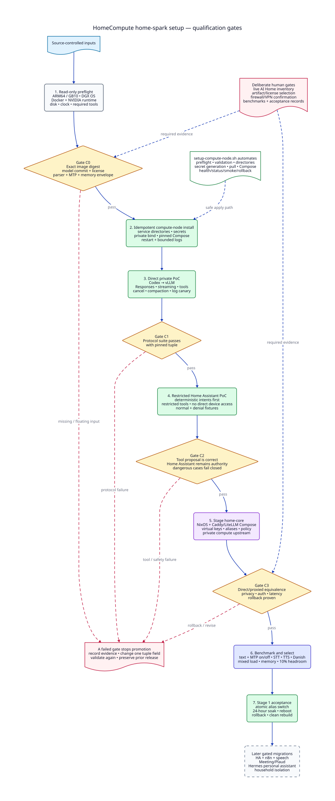

# Compute-node setup guide

**Version:** 0.1  
**Date:** 2026-08-25  
**Scope:** Phase C GB10 text-runtime foundation and target-platform overview

## What is included

The implementation artifacts deliberately follow the deployment boundaries in
the architecture and ADRs:

| Artifact | Purpose |
| --- | --- |
| `diagrams/gb10-platform.d2` | Editable target overview: clients, existing AI Home control plane, GB10 inference, durable state, cloud policy, and later Hermes layer |
| `diagrams/gb10-platform.svg` | Rendered, zoomable platform overview |
| `diagrams/gb10-installation.d2` | Editable phase/gate overview showing automated and human-qualified work |
| `diagrams/gb10-installation.svg` | Rendered, zoomable installation overview |
| `config/compute-node.env.example` | Explicit release inputs; placeholders prevent accidental deployment |
| `deploy/compute-node/compose.yaml` | Hardened, digest-pinned vLLM deployment for the first text-runtime candidate |
| `scripts/setup-compute-node.sh` | Idempotent preflight, initialization, validation, deployment, smoke, status, stop, and rollback commands |

The platform diagram is the best single-page orientation:


The installation diagram explains why deployment is staged:



Regenerate both after editing the D2 sources:

```bash
d2 --layout elk diagrams/gb10-platform.d2 diagrams/gb10-platform.svg
d2 --layout elk diagrams/gb10-platform.d2 diagrams/gb10-platform.png
d2 --layout elk diagrams/gb10-installation.d2 diagrams/gb10-installation.svg
d2 --layout elk diagrams/gb10-installation.d2 diagrams/gb10-installation.png
```

## Automation boundary

`setup-compute-node.sh` installs the **Phase C text-runtime candidate on the compute node**. It does
not claim to complete Stage 1 or install the entire future architecture.

It does not yet mutate the existing AI Home Caddy/LiteLLM deployment because
the live host, versions, keys, database, bind addresses, firewall, backup, and
rollback path remain unverified in `current-state.md`. It also does not deploy
STT, TTS, diarization, Meeting Assistant changes, or Hermes: those are later
gated phases with unresolved artifact and application-host decisions.

This is intentional. Generating plausible control-plane or personal-agent
configuration without reconciling the live systems would violate the design's
reuse, security, and rollback requirements.

## Before running it

Use the actual GX10/GB10 running its supported DGX OS. NVIDIA documents Docker
and the NVIDIA Container Toolkit as preinstalled on DGX Spark; the script
verifies them but does not replace the platform stack.

Resolve and record these Gate C0 inputs:

1. a Linux ARM64 vLLM image referenced by registry digest, never `latest` or a
   version tag alone;
2. full 40-hex commits for model, tokenizer, and trusted remote code;
3. artifact provenance URL, SPDX-style license ID, weight format,
   quantization, and the exact chat-template SHA-256;
4. the exact attention/MoE backends, reasoning/tool parsers, and MTP
   configuration;
5. a container UID/GID pinned by `init` to the non-login `gb10-ai` service
   account and verified against the selected image;
6. the GB10 private bind address and a firewall/VPN rule allowing only the AI
   Home control-plane source;
7. a Hugging Face read token and a generated vLLM service key.

The supplied candidate is `nvidia/Qwen3.6-35B-A3B-NVFP4` with the current
NVIDIA Spark recipe's `qwen3` reasoning parser and `qwen3_xml` tool parser. It
starts conservatively at 32K context, two sequences, and MTP disabled. NVIDIA's
managed single-Spark profile no longer enables MTP by default and warns that
lower resource limits do not guarantee protection from a host freeze. MTP-on
with three speculative tokens is therefore a separate experimental tuple, not
the safe baseline. Qualification compares MTP on and off and records
accepted draft tokens, output throughput, task duration, memory, long-context
behavior, tool correctness, host stability, and recovery. MTP-on cannot be
promoted without the pinned 24-hour mixed-load soak. The documented
large-tool-surface issue must be included in the Codex tool fixture suite;
passing a simple chat request is not sufficient evidence.

This Compose recipe fails closed for any other `MODEL_ID`. Challengers require
their own reviewed recipe because quantization, load format, attention/MoE
backend, MTP wiring, chat template, and parsers are model-specific.

## First deployment

Run from this repository on the GX10/GB10:

```bash
sudo ./scripts/setup-compute-node.sh init --env /etc/gb10-ai/gb10.env
sudoedit /etc/gb10-ai/gb10.env
sudoedit /etc/gb10-ai/secrets/hf_token
```

`init` is safe to rerun. It preserves operator settings while refreshing the
pinned runtime UID/GID, creates an explicit `gb10-ai` user/group and
`/srv/gb10-ai` storage tree, normalizes secret access to root:`gb10-ai` mode
0440, and generates the vLLM API key only when missing.

Run the read-only and offline checks before pulling anything:

```bash
sudo ./scripts/setup-compute-node.sh preflight --env /etc/gb10-ai/gb10.env
sudo ./scripts/setup-compute-node.sh validate --env /etc/gb10-ai/gb10.env
```

`validate` refuses:

- a floating container reference or placeholder;
- branch/tag model revisions instead of full commits;
- wildcard network binds;
- a non-loopback bind without recorded firewall confirmation and control-plane
  source;
- missing, empty, symlinked, or incorrectly owned/mode secret files (the
  non-root container requires root:`gb10-ai` mode 0440 and a mode-0750 parent);
- an unsafe installation root, invalid memory/concurrency values, malformed
  parser/backend names, or an unrecognized baseline MTP configuration. An empty
  value is accepted only as the explicitly recorded MTP-off comparison;
- any Phase C storage/secret path other than `/srv/gb10-ai`,
  `/etc/gb10-ai/secrets/hf_token`, and
  `/etc/gb10-ai/secrets/vllm_api_key`;
- an invalid rendered Compose configuration.

`preflight` also checks `jq` and `sha256sum` before the image is pulled. For a
non-loopback bind, the validator checks the recorded IPv4/CIDR syntax, but
`FIREWALL_CONFIRMED=true` remains a human attestation: the script does not
inspect or modify the host firewall/VPN policy.

Deploy only after both commands pass:

```bash
sudo ./scripts/setup-compute-node.sh install \
  --env /etc/gb10-ai/gb10.env \
  --wait 1200
```

The install command pulls the exact digest, runs `nvidia-smi` inside that image,
starts vLLM, waits for container health, verifies all six logical aliases, runs
a minimal Responses request, and writes a secret-free release record under
`/srv/gb10-ai/manifests`.

## Operations and rollback

```bash
sudo ./scripts/setup-compute-node.sh status --env /etc/gb10-ai/gb10.env
sudo ./scripts/setup-compute-node.sh smoke --env /etc/gb10-ai/gb10.env
sudo ./scripts/setup-compute-node.sh logs --env /etc/gb10-ai/gb10.env
sudo ./scripts/setup-compute-node.sh down --env /etc/gb10-ai/gb10.env
```

Keep every accepted environment file with its release evidence. To restore an
earlier exact tuple:

```bash
sudo ./scripts/setup-compute-node.sh rollback \
  --env /etc/gb10-ai/releases/previous.env \
  --wait 1200
```

Rollback deploys the prior pinned image/model tuple and repeats health and smoke
checks. It never deletes model caches, secrets, manifests, or the previous
image. Alias switching at the Caddy/LiteLLM control plane remains a Gate C3/E
operation after that live deployment has been inventoried and qualified.

## Required qualification after the smoke test

The smoke test proves only that the service starts and exposes the expected
surface. Gate C1 still requires V-CODEX-001: Responses SSE completion, serial,
parallel and namespaced tools, malformed calls, MCP round trips,
cancel/disconnect behavior, reasoning, compaction, privacy canaries, and the
large-tool-count regression. Danish/English quality, Home Assistant safety,
memory, mixed load, recovery, and 10% production headroom are later gates.

Do not expose port 8000 to the client LAN or internet. The eventual consumer
path is `client -> https://ai.home -> Caddy -> existing LiteLLM -> private
GB10`, with Caddy routing fixed audio paths directly to separately qualified
audio services.
